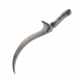

# 使命短刀

- **武器品质**：白
- **类型**：攻击力
- **FP**：    |    **重量**：

### 攻击力

| 项目 | 数值 |
|---|---|
| 物理 | 71 |
| 魔力 | 0 |
| 火 | 0 |
| 雷 | 0 |
| 圣 | 43 |
| 致命一击 | 110 |
| 魔法加成 |  |

### 防御时减伤率

| 项目 | 数值 |
|---|---|
| 物理 | 31 |
| 魔力 | 18 |
| 火 | 18 |
| 雷 | 18 |
| 圣 | 30 |
| 防御强度 | 15 |

### 能力加成

| 项目 | 数值 |
|---|---|
| 力气 | D |
| 灵巧 | D |
| 智力 | - |
| 信仰 | C |
| 感应 | - |

### 必需能力值

| 项目 | 数值 |
|---|---|
| 力气 | 6 |
| 灵巧 | 13 |
| 智力 | 0 |
| 信仰 | 15 |
| 感应 | 0 |

> 为了使命踏上旅程者受赠的短刀。
> 武器上还残存先前的持有人──
> 火种少女的力量。
> 伴火同进者，
> 终有一天会遇见命定之死。

**获取地点**：赐福-禁域，右手电梯，上升过程中有一处隐藏通道和房间，房间内拾取

**专属战技**：黄金刀刃  
跳至空中，让武器缠绕黄金火焰，
将火焰化为刀刃后释放的战技。
能给予圣属性伤害。

**武器使用强化石类型**：失色锻造石
